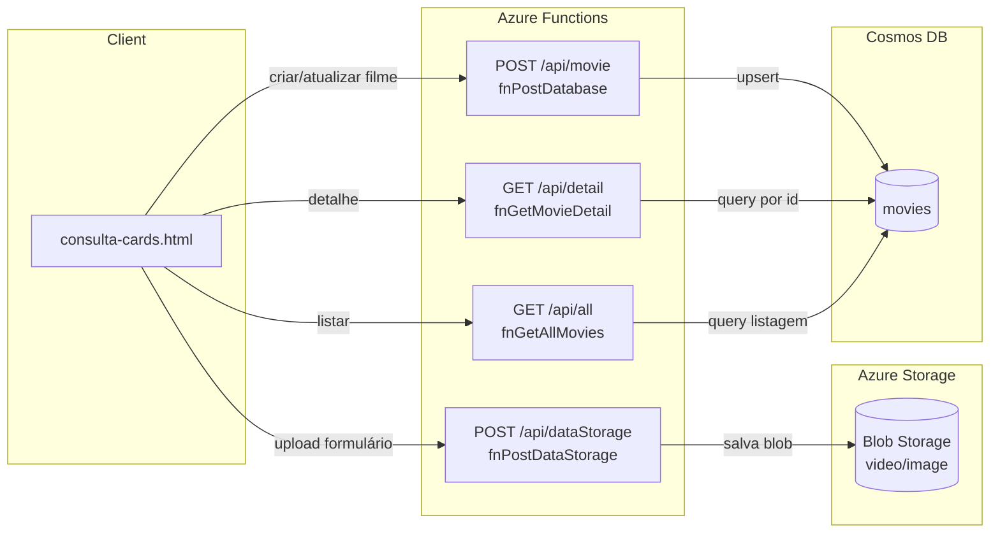
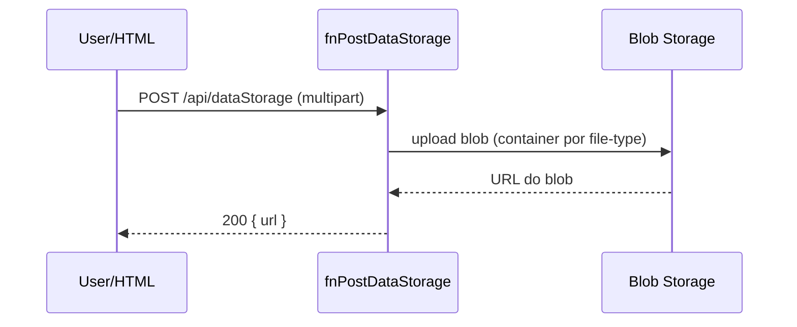
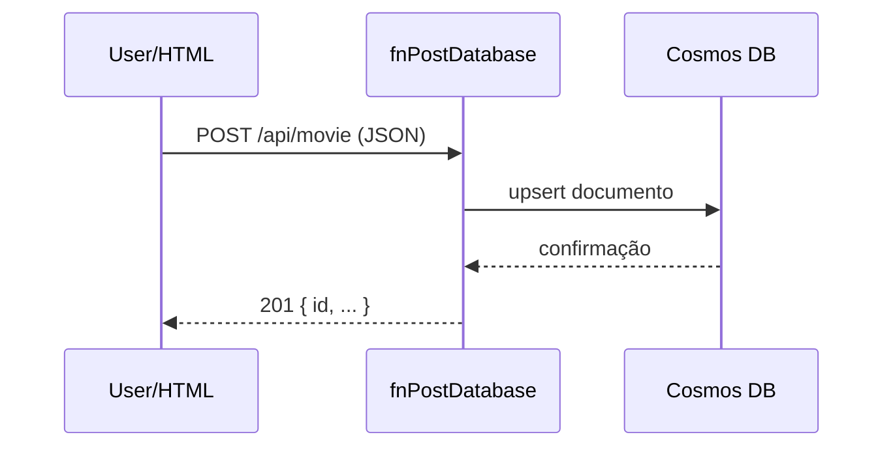
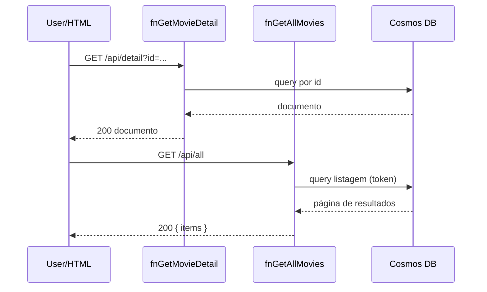

# Arquitetura do projeto

Este documento descreve a arquitetura lógica das APIs do projeto (estilo serverless em Azure Functions) para gerenciar um catálogo de filmes.

## Visão Geral

Componentes principais:
- Azure Functions:
  - `fnPostDataStorage` (HTTP POST `/api/dataStorage`): upload de arquivos binários (vídeo/imagem) para Azure Blob Storage.
  - `fnPostDatabase` (HTTP POST `/api/movie`): grava/atualiza o documento do filme (Cosmos DB) com metadados e URLs de mídia.
  - `fnGetMovieDetail` (HTTP GET `/api/detail?id=...`): retorna o documento de um filme por `id`.
  - `fnGetAllMovies` (HTTP GET `/api/all`): lista paginada de filmes.
- Armazenamentos:
  - Azure Blob Storage: containers `video` e `image` (exemplo), públicos via SAS/URL.
  - Azure Cosmos DB (API SQL) ou similar: coleção `movies` com partição por `id` (ou `year`).
- Cliente demo: `consulta-cards.html` consome as APIs via chamadas HTTP.

## Diagrama de Componentes



## Modelo de Dados (Cosmos DB)

Exemplo de documento `movie`:
```json
{
  "id": "a-random-guid-generated",
  "title": "Harry Potter e o cálice de fogo",
  "year": "2005",
  "video": "https://<account>.blob.core.windows.net/video/video.mp4",
  "thumb": "https://<account>.blob.core.windows.net/image/thumbvideo.jpg",
  "createdAt": "2025-09-18T12:00:00Z",
  "updatedAt": "2025-09-18T12:00:00Z"
}
```
Particionamento sugerido:
- `partitionKey`: `/id` para simplicidade em demos, ou `/year` para consultas por ano.

Índices:
- Padrão do Cosmos DB é suficiente; opcionalmente indexar `year`.

## Endpoints e Contratos

- POST `/api/dataStorage`
  - Headers: `file-type: video|image`
  - Body (multipart form): `file=@/caminho/arquivo`
  - Respostas:
    - 200: `{ url: "https://..." }`
    - 400/415/500 conforme erros

- POST `/api/movie`
  - Body (JSON): `{ id, title, year, video, thumb }`
  - Respostas:
    - 201: `{ id, ... }`
    - 400/409/500

- GET `/api/detail?id=<guid>`
  - Respostas:
    - 200: documento do filme
    - 404 se não encontrado

- GET `/api/all?continuationToken=&pageSize=20`
  - Respostas:
    - 200: `{ items: [...], continuationToken }`

## Fluxos

### Upload da Mídia


### Criação do Filme


### Consulta


## Configuração e Ambiente

Variáveis de ambiente (exemplo):
- `AzureWebJobsStorage`: connection string da storage account (Functions/Blobs)
- `MoviesCosmos__ConnectionString`: conexão do Cosmos DB
- `MoviesCosmos__Database`: nome do database (ex: `catalog`)
- `MoviesCosmos__Container`: nome do container (ex: `movies`)
- `BlobStorage__Account`: nome da conta
- `BlobStorage__Containers__Video`: `video`
- `BlobStorage__Containers__Image`: `image`

Segurança:
- Preferir SAS com tempo limitado ou acesso via função proxy em produção.
- Validar `file-type` e tamanho/tipo MIME.
- Sanitizar metadados e limitar extensões.

Escalabilidade:
- Functions com plan Consumo; Cosmos DB throughput em RU/s ajustável.
- Uploads grandes via `block blobs` e `chunked upload`.

Observabilidade:
- Application Insights (logs/traces/depuração).

## Referências de cURL (dev)

- Upload para Storage:
```
curl --location 'http://localhost:7217/api/dataStorage' \
  --header 'file-type: video' \
  --form 'file=@"/caminho/arquivo/video.mp4"'
```

- Criar filme:
```
curl --location 'http://localhost:7210/api/movie' \
  --header 'Content-Type: application/json' \
  --data '{ "id": "a-random-guid-generated", "title": "Harry Potter e o cálice de fogo", "year": "2005", "video": "https://<account>.blob.core.windows.net/video/video.mp4", "thumb": "https://<account>.blob.core.windows.net/image/thumbvideo.jpg" }'
```

- Detalhe por Id:
```
curl --location 'http://localhost:7296/api/detail?id=b5d9c3e9-151a-479b-be06-cf48e815299c'
```

- Listar todos:
```
curl --location 'http://localhost:7239/api/all'
```
